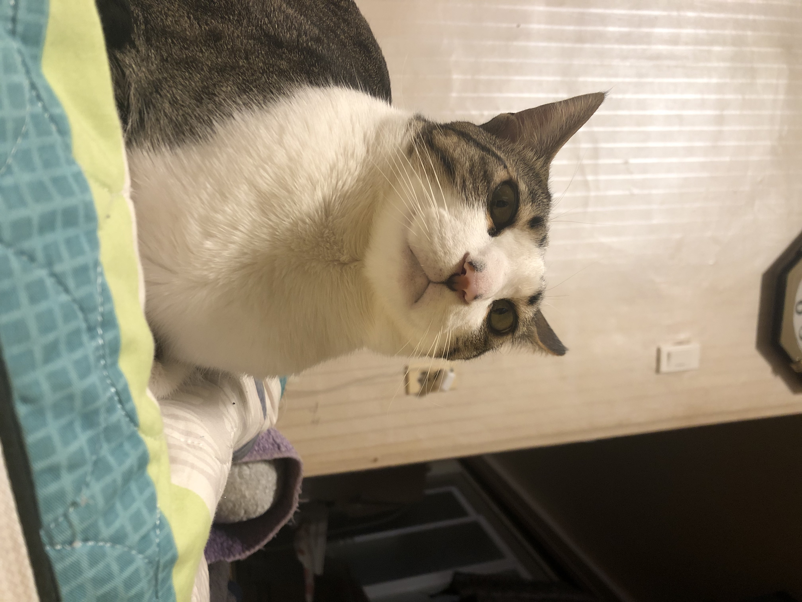

# Kafka Example - Large Size Image Message  

When Kafka producer send message that has size over `max.request.size`, the message can't send at once.
This example project is about producer that send large size image by chopping to segments, and consumer that merge the segments to original image.

## Getting started 

### 1. Set Environments

First of all, create `chopped-image` topic that used to produce and consume.
you should set the options {`bootstrap-server`, `partitions`, `replication-factor`} according to your environment.

```shell script
$ kafka-topics \
--bootstrap-server localhost:9092 \
--create \
--topic chopped-image \
--partitions 1 \
--replication-factor 1
```

After topic is created, you should modify the source code about `bootstrap-server` configuration.

```java
// ImageProducer#main
...
    // broker configure
    Map<String, Object> props = new HashMap<>();
    props.put(ProducerConfig.BOOTSTRAP_SERVERS_CONFIG, "localhost:9092"); // <- 
```

```java
// ImageConsumer#main
...
    // broker configure
    Map<String, Object> props = new HashMap<>();
    props.put(ConsumerConfig.BOOTSTRAP_SERVERS_CONFIG, "localhost:9092"); // <-
```

### 2. Run Main()

Run `ImageConsumer#main` first, after that run `ImageProducer#main`.
because ImageConsumer consume messages infinitely, but ImageProducer produce messages at once.

if producing and consuming is success, you can see console message on your IDE as shown below.

```log
# ImageProducer console
== total image size : 1884281
== send result
* partition  : 0
* offset     : 0
* timestamp  : 1582638573354
* value size : 500041
...
```

```log
# ImageConsumer console
== image [over_max_size.jpg] is wrote
* size : 1884281
```

### 3. Check Result

If you success to producing and consuming the large image, you can see the image in `image-consumer/images/` directory.

